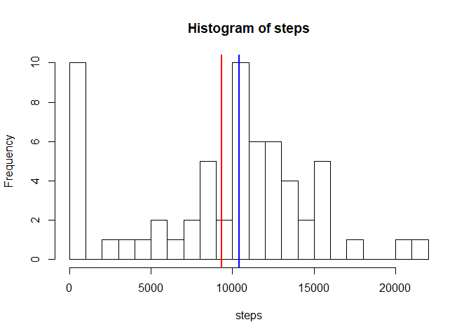
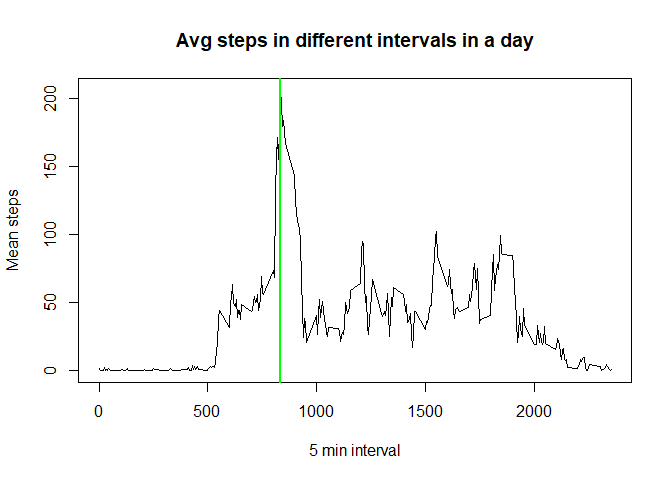
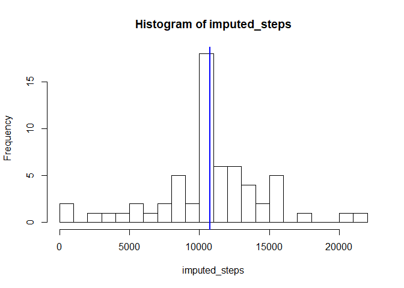
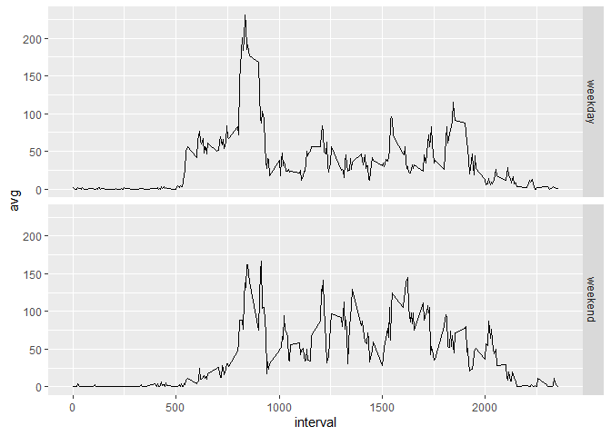

## Loading and preprocessing the data  
Code to read data  

```r
data <- read.csv(unz("activity.zip", "activity.csv"),stringsAsFactors=FALSE,na.strings = "NA")
```

The data contains the number of steps taken by an individual in 5 minute intervals for two months. October and November, 2012.
Records range from 0 to 2355 minutes everyday for 61 days.


```r
nrow(data)
```

```
## [1] 17568
```

```r
names(data)
```

```
## [1] "steps"    "date"     "interval"
```

```r
head(data)
```

```
##   steps       date interval
## 1    NA 2012-10-01        0
## 2    NA 2012-10-01        5
## 3    NA 2012-10-01       10
## 4    NA 2012-10-01       15
## 5    NA 2012-10-01       20
## 6    NA 2012-10-01       25
```

```r
length(unique(data$date))
```

```
## [1] 61
```

```r
summary(data)
```

```
##      steps            date              interval     
##  Min.   :  0.00   Length:17568       Min.   :   0.0  
##  1st Qu.:  0.00   Class :character   1st Qu.: 588.8  
##  Median :  0.00   Mode  :character   Median :1177.5  
##  Mean   : 37.38                      Mean   :1177.5  
##  3rd Qu.: 12.00                      3rd Qu.:1766.2  
##  Max.   :806.00                      Max.   :2355.0  
##  NA's   :2304
```
## What is mean total number of steps taken per day? 

Number of readings per day = total number of readings/number of days = 17568/61 = 288  

Histogram of total steps:  


```r
start = 0
steps= c()
for (i in seq(61)) 
{
  data_per_day <- data$steps[(start+1):(i*288)]
  start = i*288
  steps[i] = sum(data_per_day, na.rm=TRUE)
}
hist(steps, breaks=25)
abline(v=mean(steps),col="red",lwd=2)
abline(v=median(steps),col="blue",lwd=2)
```

<!-- -->


```r
print(mean(steps))
```

```
## [1] 9354.23
```

```r
print(median(steps))
```

```
## [1] 10395
```

The mean of total steps taken each day is 9354.23, and the median is 10395. These values are highlighted in the histogram as red and blue lines. 

## What is the average daily activity pattern?


```r
daily_means =c()
j=1
for (i in unique(data$interval)) 
{daily_means[j]<-mean(data$steps[data$interval == i], na.rm=TRUE)
j = j+1}
plot(unique(data$interval),daily_means, type='l', main="Avg steps in different intervals in a day", xlab="5 min interval", ylab='Mean steps')
abline(v=835,col="green", lwd=2)
```

<!-- -->


```r
id <- which.max(daily_means)
unique(data$interval)[id]
```

```
## [1] 835
```
The time interval 835 has highes average number of steps  

## Imputing missing values


```r
for (i in seq(ncol(data)))
{
print(sum(is.na(data[,i])))
}
```

```
## [1] 2304
## [1] 0
## [1] 0
```

There are 2304 missing (NA) values in steps column. No missing data in other columns   
We use mean of steps taken in each 5 minute interval, that we have already calculated, to fill the missing values.   We use this method as the time affects the number of steps (ex: a person might exercise at a particular time everyday)  


```r
imputed_data <- data
j=1
for (i in unique(data$interval))
{
  subset <- imputed_data$steps[imputed_data$interval == i]
  subset[is.na(subset)] <- daily_means[j]
  imputed_data$steps[imputed_data$interval == i] <- subset
  j = j+1
}
```
  
Plotting histogram for imputed data:  


```r
start = 0
imputed_steps= c()
for (i in seq(61)) 
{
  data_per_day <- imputed_data$steps[(start+1):(i*288)]
  start = i*288
  imputed_steps[i] = sum(data_per_day, na.rm=TRUE)
}
hist(imputed_steps, breaks=25)
abline(v=mean(imputed_steps),col="red",lwd=2)
abline(v=median(imputed_steps),col="blue",lwd=2)
```

<!-- -->


```r
print(mean(imputed_steps))
```

```
## [1] 10766.19
```

```r
print(median(imputed_steps))
```

```
## [1] 10766.19
```

```r
(10766.19-9354.23)
```

```
## [1] 1411.96
```

```r
(10766.19-10395)
```

```
## [1] 371.19
```

Mean and median values have become same, that is 10766.19. It is highlighetd in the histogram.  
The mean hase increased by (10766.19-9354.23) = 1411.96, and the median has increased by (10766.19-10395) = 371.19  
Due to imputation, the mean and median have increased. It has also increased the frequency of some step values.

## Are there differences in activity patterns between weekdays and weekends?

Creating weekday factor:    


```r
imputed_data$date <- as.Date(imputed_data$date)
days <- weekdays(imputed_data$date)
i=1
day_type = c()
for (day in days)
{
  if (day == 'Saturday' || day == 'Sunday')
  {
    day_type[i] <- 'weekend'
  }
  else
  {
    day_type[i] <- 'weekday'
  }
  i = i+1
}
imputed_data$day_type <- as.factor(day_type)
summary(imputed_data)
```

```
##      steps             date               interval         day_type    
##  Min.   :  0.00   Min.   :2012-10-01   Min.   :   0.0   weekday:12960  
##  1st Qu.:  0.00   1st Qu.:2012-10-16   1st Qu.: 588.8   weekend: 4608  
##  Median :  0.00   Median :2012-10-31   Median :1177.5                  
##  Mean   : 37.38   Mean   :2012-10-31   Mean   :1177.5                  
##  3rd Qu.: 27.00   3rd Qu.:2012-11-15   3rd Qu.:1766.2                  
##  Max.   :806.00   Max.   :2012-11-30   Max.   :2355.0
```

Plotting average steps:  


```r
library(dplyr)
```

```
## Warning: package 'dplyr' was built under R version 3.6.2
```

```
## 
## Attaching package: 'dplyr'
```

```
## The following objects are masked from 'package:stats':
## 
##     filter, lag
```

```
## The following objects are masked from 'package:base':
## 
##     intersect, setdiff, setequal, union
```

```r
library(ggplot2)
filtered_data <- data.frame(imputed_data %>% group_by(day_type,interval) %>% summarise(avg = mean(steps)))
ggplot(filtered_data, aes(interval,avg)) +
  geom_line() +
  facet_grid(day_type~.)
```

<!-- -->
